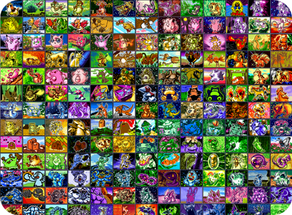
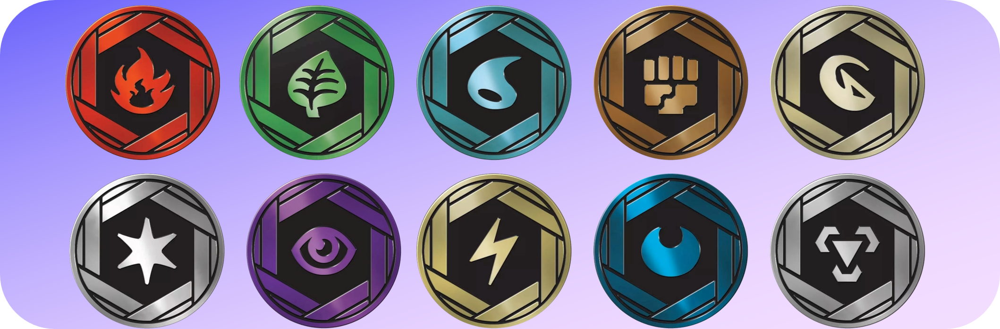
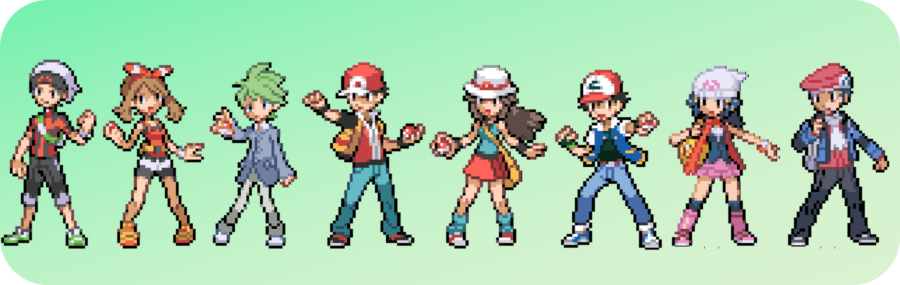

# Pokemon-TCG-Legacy

I have made this because Nintendo refuse to make a sequel to the original Gameboy Pokemon TCG game. We never got a new installment since GB2 Rocket Returns so for fans of old Pokemon cards we have literally nothing.

My favourite sets have always been the ex series, and specifically the Delta Species sets near the end of the ex era. Therefore every card from Base set to Ex Power Keepers is available and usable in this game, with potential to add the DP era set, but no concrete plans for that yet. 

## Gameplay
Collect every card from Base set to EX Power Keepers, build your own decks and use them against over 100+ opponent CPU decks

### Coin selection
Collect over 100+ coins by winning matches and select them to use in game

### Trainer customization
Select from over 100+ character sprites for overworld and in battle

