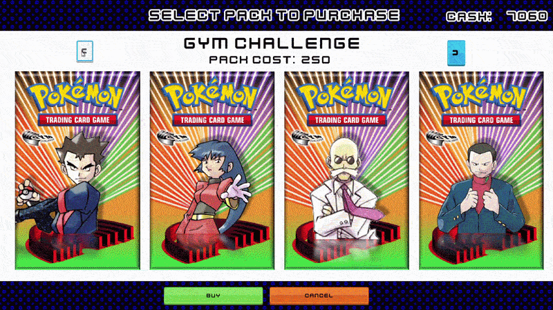

# Pokémon TCG Legacy

## The Game

Pokemon TCG Legacy is my modern take on the old Pokémon Trading Card GB games created entirely from the ground up in Godot GD script, so this isn't a rom hack or an RPG maker game release, everything in the game has been coded entirely from scratch in the Godot Engine. 

Pokémon TCG 2: The Invasion of Team GR!  was released in 2001 and was the last single player PTCG experience we got.  For over ****25 years,**** every game since has been an entirely online PvP focused experiences. Pokémon TCG Legacy focuses entirely on a single-player experience, building your own collection of cards through in game battles against unique and varied decks and unlocking new sets naturally as you progress (of course with no real world money to spend).

The story isn't a continuation from the original Pokemon TCG GB and GB2, but instead aims to be an entirely unique experience of it's own. My aim is to capture the satisfaction of earning and collecting new cards and rewarding experimentation with deck building, facing off against opponents with wildly different decks and strategies. No reliance on established metas meaning you won't be seeing the same deck every match, leaving you free to fully experiment with your favourite cards that you actual want to use.

### Rich open world

A vibrant never before seen open world with unique locations across the map to explore. Each area is filled with dozens of unique NPCs and opponents to play against. As you progress you will naturally unlock more areas, NPCs, sets and opponents throughout the game.

### Battle Simulation Built From Scratch

A battle engine built from the ground up with every card, attack and effect from the first 3 generations. A lot of decks will be genuinely challenging as opponents will test you and make your victories earned. Battles are quick and fun and reward you with new cosmetics and cash for more cards with every new win.

Natural tutorial and game opening has been added so instead of a hard forced "tutorial", the game is learnt to be played through regular gameplay.

### Day - Night cycles change the landscape

Time naturally progresses throughout the day as you battle. NPCs have different habits, offering gifts, battles or varying speech depending on the time of day you interact with them. The world map changes and develops as time progresses, making the world feel actually lived in.



### Complete Card Collection (Base Set → EX Era)

Collect every single card from **Base Set** all the way through to **EX Power Keepers**. 3285 collectible cards across 37 individual sets. Build custom decks and experiment freely within the rules of the official Pokemon TCG. All card information is displayed in full making it the ultimate card database to view all of your favourite cards in full detail.

### Familiar NPCs and gifts

You can interact with familiar and legendary NPCs in the overworld - GYM leaders from Kanto will make an appearance allowing you to speak to old friends. Some NPCs will provide you with a gift when spoken to, encouraging you to build up your collection not just by battling but by interacting with everyone in the overworld.

### Pack purchasing

Spend your well earned cash in the Card Marts to buy packs and unlock new cards for you to use in your decks. You might get lucky and find a bonus rare card in some parks or possibly....even an elusive god pack?

 

### Trainer Customization

Unlock **200+ unique sprites** as you progress through the game. Freely set your favourite and unlock more as you progress through the game and see all your in game stats on your player info page.

### 400+ Collectable Coins and Card Sleeves

Win coins and sleeves as rewards for every battle and find some as gifts to use them in your matches. 

### Endless replayability

Hundreds of unique decks and opponents to battle so you never have to battle the same opponent twice! (Unless you want to)



## Technical

Built in **Godot 4.6** using GDScript. The battle engine handles complex card interactions, trainer cards, Pokémon Powers, energy systems, status effects, and damage calculations. All the mechanical depth of the real TCG, translated to digital form.

# Update on 24/08/2026

Every single card set is now technically implemented. That's all 39 sets and over 3,000 cards playable covering Promos, e-card series, neo, the entire EX era and POP series 1-5.

Key things **already implemented** to look forward to:

1. All cards from Base set Gym Hero/Challenge can be used, earned and purchased from in shops, technically every card from neo-ex power keepers is implemented but not obtainable.
2. Full TCG battle engine written from scratch, all 1061 unique attack effects, 270 Poke-powers and bodies, 284 trainers, 52 stadium cards and 19 special energies all implemented faithfully to the original prints.
3. A fully logically thinking opponent CPU with board evaulation, providing a genuine challenge to battle against.
4. All main explorable areas completed for the Kanto era cards with both open exteriors and explorable interiors mapped.
5. Living Morning, Afternoon, Evening and Night cycle with different NPC behaviours and map changes depending on the time of day.
6. 100+ Opponents to battle already with another 100 NPCs to interact with, all with unique dialogue, gifts and changing interactions depending on time of day. 
7. "Boss" battles with meta decks and Gym Leader gauntlet resulting in story progression and big rewards
8. Challenge battles with a combination of 30 different bonus gameplay modifiers such as damage mutipliers, weakness and resistance changes, double energy attachment and card restrictions.
9. Complete deck builder and card database search and viewer, allowing you to build decks with any of all 3000+ cards, view them in full screen with card text shown in full detail. Advanced filtering allowing you to search for specific cards for your deck.
10. Hundreds of cosmetics to chase — 221 trainer sprites, 589 card sleeves, 419 collectible coins, five trainer card designs and six energy card styles, all tracked on your trainer card.

The game is technically playable now, you could download the godot project from git and run it in debug mode and get a couple hours enjoyment out of it, but it's still buggy and janky with a lot of issues that need working out. I'm still adding a few final features, a bit of polish here and there and most importantly debugging all the hundreds of issues that exists. I'm aiming to have the game fully playable by the end the year and I'm pretty confident I'll hit that target.

## Planned features and gameplay progression plan before considering done

1. Most immediate requirements are now just fixing all the bugs within the battle system and main game.

2. More NPCs need adding to flesh out the world and add flavour text, guidance or gifts.

3. All decks needs battling against fully and adjusting to make them as good as possible. A lot of decks will require tweaking.

4. Add Pokemon to the overworld to flesh out the world along with the additional NPCs.

5. Rival/Friend planned with specific interactions, helping you start the game and giving you a nudge in the right direction while testing your skill as you progress.

6. Add controller support for windows. Most overworld interacions already support this, but a lot of additional work is required for in game matches to be controller supported instead of mouse clicks

Consider this phase 1 complete and a 'finished' game that's playable with a story and rich enough features to be a dozen or so hours gameplay

# Phase 2 definitely coming next

1. Add Neo set era cards available to use and purchase
2. Create another 100+ decks from Neo era with 100+ Opponents to match
3. Allow pokemon to be followers and allow some pokemon to evolve when certain conditions are met
4. Add "Southern Island" map area with complete SI set gifted for beating all opponents, while also recreating Southern island cards to fix terrible reverse holo image scans
5. 3-4 new major map areas for Neo era cards. Travel between all areas via train and boat
6. Recreate custom translated versions of the Pokemon VS set and implement into the game resulting in Johto Gym Challenge using the VS set

Consider this end of phase 2 and next large update to game

# Future features planned

1. Implement all EX generation card sets from Ruby Sapphire to end of Delta species
2. Implement EX era overworlds and opponents
3. Add double battle matches as per EX era rulesets

Consider this finished game as intended and planned

# Unplanned features

1. Diamond/Pearl onwards currently not planned to be implemented
2. Release will be windows exe only, no android/ios will be released.

---

**Status**: Active Development and technically playable. Roughly 80% complete before phase 1 release
