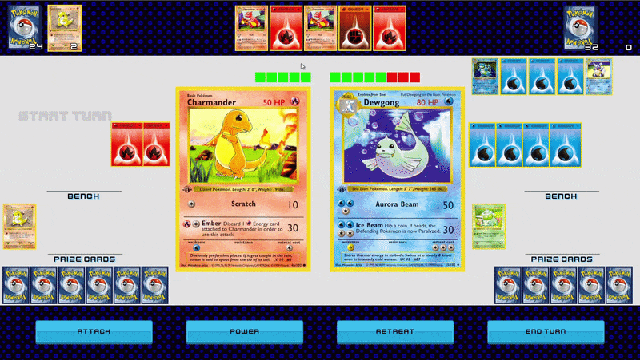
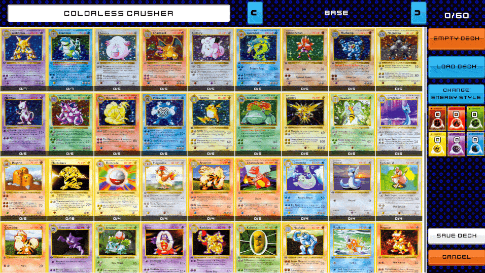
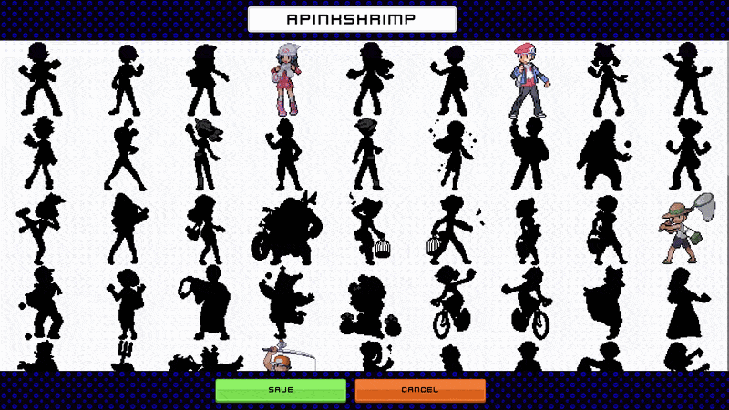
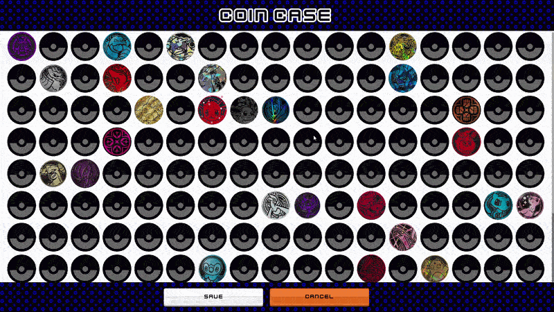
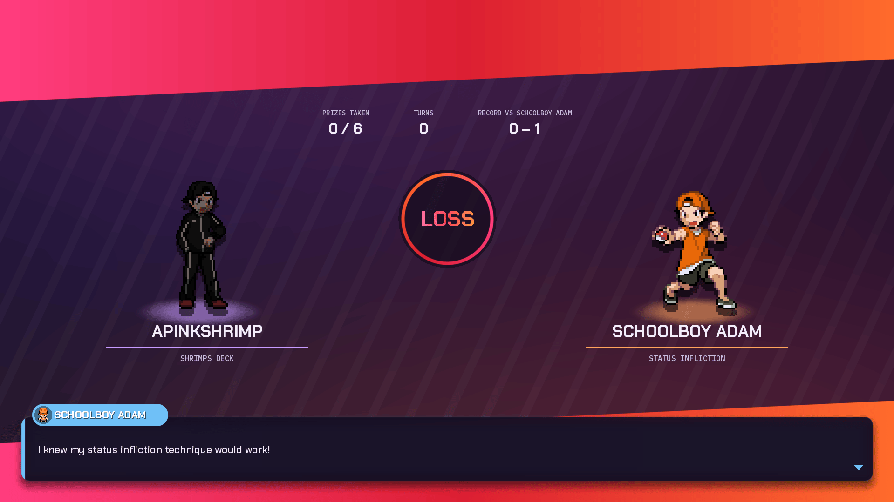
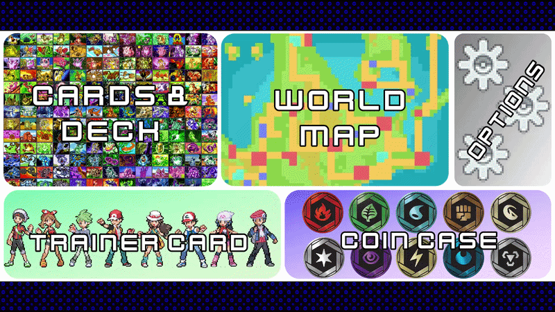
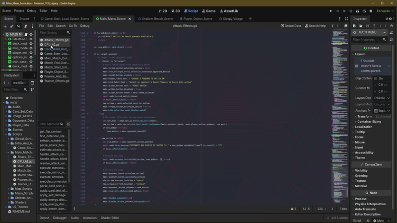

# Pokémon TCG Legacy

Pokemon TCG Legacy is a spiritual successor and modern take on the original Pokémon Trading Card GB games. Since Pokémon TCG 2: The Invasion of Team GR! (2001), the Pokemon TCG video game landscape has been entirely focused on PvP online experiences. **Pokémon TCG Legacy** focuses on what's been missing since the glory days of the GB games: a deep single-player campaign focusing on building your own collection through strategic battles against uniquely crafted CPU opponents, collecting cards and unlocking new sets naturally as you progress.

The story isn't a continuation from the original Pokemon TCG GB and GB2, Instead it captures the spirit of what made those games legendary; the satisfaction of earning and collecting new cards to experiment deck building with and facing off against opponents with wildly different strategies and playstyles. Every battle earns you closer to completing a set and every victory feels rewarding. No reliance on established metas and seeing the same deck every match.

## Core Features

### Battle Simulation Built From Scratch
Fight against 100+ curated CPU opponent decks in a battle engine built from the ground up. These aren't random weak opponents, you will be battling against decks with strategy and synergy. Opponents play competently and make your victories feel earned. Battles are quick and fun but meaningful enough to matter.

### Complete Card Collection (Base Set → EX Era)
Collect every card from **Base Set** all the way through to **EX Power Keepers** - spanning nearly 2,000 collectible cards across nearly 30 individual sets. Whether you're hunting down a complete playset of classic cards or chasing the elusic rar Gold Star cards, the collection is here waiting for you. Build custom decks and experiment freely.

### Trainer Customization
Unlock **100+ unique trainer sprites** as you progress through the game. Choose your favorite trainer class sprite for both overworld and in battle and battle every opponent to unlock them all.

### 100+ Collectable Coins
Win coins as rewards by battling opponents and use them in your matches. Earn your favorites and add flair to your matches.

### Living Overworld
Traverse a world populated with diverse trainer classes, each with different deck archetypes and playstyles. The variety keeps progression fresh and forces you to adapt your deck and playstyle.

## Card Pool Details

The card selection spans the most iconic sets of the Pokémon TCG:

- **Base Era** - Base set to Gym Challenge: The classics that started it all
- **Neo Generations** - Neo Genesis to Neo Destiny: The introduction of gen 2 Pokemon
- **ECard Series** - Expedition to Skyridge: The end of gen 2
- **EX Era** Ruby & Sapphire to Unseen Forces: Gen 3 pokemon make their debut
- **Delta Series** Delta Species to Power Keepers: The last sets before DP Series

*Future updates may include the DP era, but no concrete timeline exists yet.*

## Progression & Replayability

- Progress through the campaign, battle new opponents and unlock new cards and sets as you advance
- Experiment with different deck archetypes against a wide variety of playstyles
- Build toward 100% card collection completion
- Each opponent offers unique challenge patterns—rematches aren't guaranteed to be identical

## Technical

Built in **Godot 4.5** using GDScript. The battle engine handles complex card interactions, trainer cards, Pokémon Powers, energy systems, status effects, and damage calculations. All the mechanical depth of the real TCG, translated to digital form.

## Inspiration

This project exists because the TCG GB games filled a niche that modern Pokémon TCG games have abandoned. I hate constantly battling the same 2 meta decks match after match and needing to pay real money to progress in game, that's now what the original games were about. They were all for the satisfaction of building something fun and experimenting with the cards you like.

---

**Status**: Active Development  
**Engine**: Godot 4.5  
