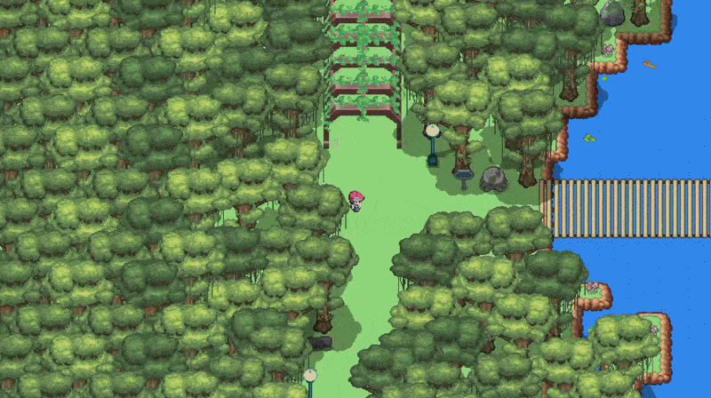
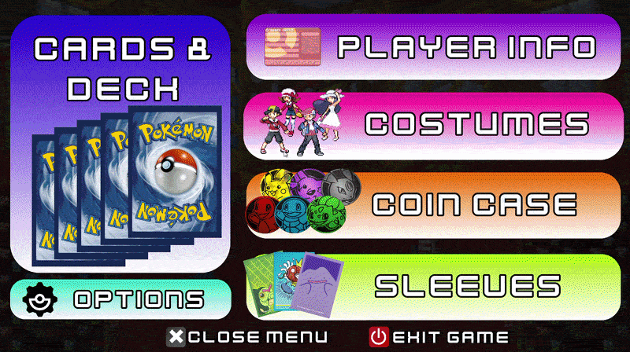
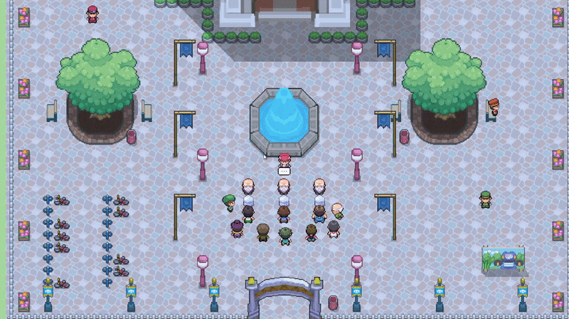
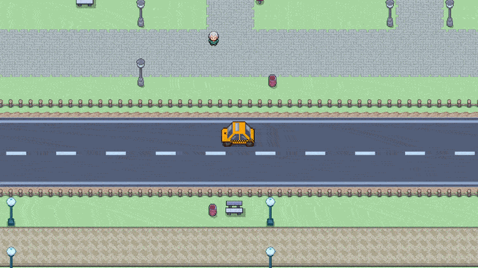
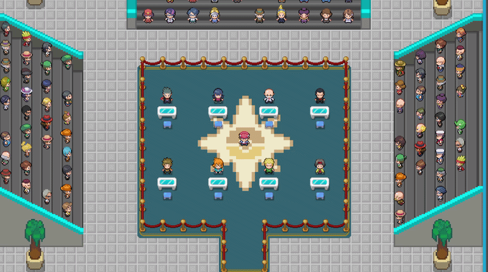
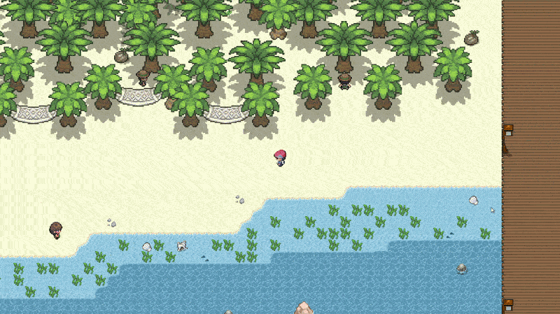
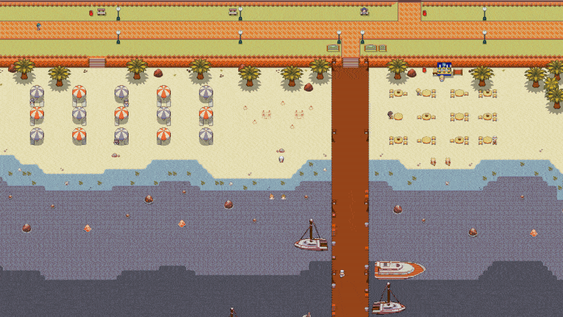
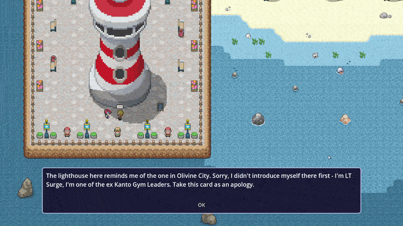
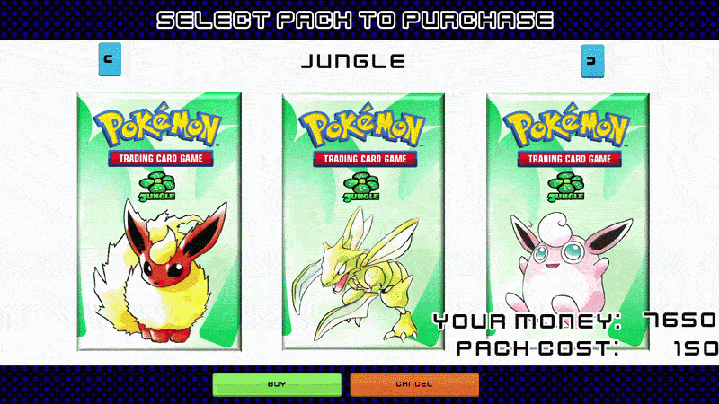

# Pokémon TCG Legacy

# Update as of 19/07/2026

Every single card set is now technically implemented. That's all 40 sets and nearly 2,000 cards playable covering Promos, e-card series, neo, the entire EX era and POP series 1-6.

Other significant changes:

1) Added 4th times slot. Morning - Afternoon - Evening - Night with variation in map colours opponents and NPC across each
2) Added 300+ card sleeve designs each opponent get their own sleeves and most will gift theirs
3) Completely redesigned the main menu and added a player info screen for stats
4) Verdant Forest redesigned with new layout and features

Main focus is now bug fixing. As slyly wrote, all cards are "technically implemented". Large chunk of errors across the board so I've set up a proper issue log and debug tools to help.

# Update as of 23/06/2026

Work is still going well, fully implemented all sets from Base set to end of Neo cards with bugs that need fixing. Progress is still being made daily, multiple map areas have been made and currently around 100 opponents with unique decks implemented, and each gives a unique coin as a win reward, so currently over 100+ coins to collect and use. 

Starting system has been added to game so there is a natural intro and instead of a "tutorial", the game is learnt to be played naturally through regular gameplay progression. 

Key things **already implemented** to look forward to: 

1) All cards from Base set Gym Hero/Challenge can be used, earned and purchased from in shops
2) Pack opening experience with higher hit rates than regular tcg. God packs?
3) 100+ Opponents to find in the overworld ready to be battled each with a unique decks and a unqiue coin reward 
4) "Open world" style gameplay with 3 Large map areas implemented
5) "Boss" battles with meta decks and gym leaders resulting in story progression and big rewards
6) Challenge battles with bonus gameplay modifiers such as damage mutipliers, weakness and resistance changes, double energy attachment and card restrictions.
7) Kanto era ends with Gym Hero Challenge, a best of 3 with every kanto gym leader in order to progress to the Neo set game area.

# Planned features and gameplay progression plan before considering done

1) Most immediate requirements are now just fixing all the bugs within the battle system and main game.

2) More NPCs need adding to flesh out the world and add flavour text, guidance or gifts.

3) All decks needs battling against fully and adjusting to make them as good as possible. A lot of decks will require tweaking.

4) Add Pokemon to the overworld to flesh out the world along with the additional NPCs.

5) Add Challenge decks with bonus modifiers after Gym Challenge.

6) Add "End" of Kanto area (planned but not implemented so no spoilers).

-- Consider this phase 1 finished and a 'finished' game that's playable with a story and rich enough features to be a dozen or so hours gameplay --

# Future features considered as phase 2 definitely coming

1) Add Neo set era cards available to use and purchase
2) Create another 100+ decks from Neo era with 100+ Opponents to match
3) Allow pokemon to be followers by giving each pokemon a unique item acquired as gifts or puchased from shops
4) Allow some pokemon to evolve by getting X amount of match wins with it as a follower
5) Add "Southern Island" with complete SI set gifted for beating all opponents (1 of each card) which then makes then availble for sale.
6) Recreate Southern island cards as custom cards to fix terrible reverse holo images
7) 3-4 new map areas for Neo era cards. Travel between all areas via train or boat
8) Recreate custom translated versions of the Pokemon VS set and implement into the game
9) Add Johto Gym Challenge same as Kanto Gym challenge but with VS set
10) Add "End" of Johto area

---- Consider this end of phase 2 and next large update to game ====

# Final features planned

1) Implement all EX generation card sets from Ruby Sapphire to end of Delta species
2) Implement EX era overworlds and opponents
3) Add double battle matches as per EX era rulesets

---- Consider this finished game as intended and planned ----

# Unplanned features as of 06/2026

1) Diamond/Pearl onwards currently not planned to be implemented
2) Release will be windows exe only, no android/controller support

## The Game

Pokemon TCG Legacy is my modern take on a spiritual successor to the original Pokémon Trading Card GB games. Pokémon TCG 2: The Invasion of Team GR! (2001) was the last true single player Pokemon TCG game experience as each game that followed has been entirely online PvP focsused experiences. **Pokémon TCG Legacy** focuses on what's been missing this whole time since the old GB games: A single-player campaign and story focusing on building your collection of cards through in game battles against unique and varied decks, unlocking new sets naturally as you progress.

The story isn't related or a continuation from the original Pokemon TCG GB and GB2, instead it captures the spirit of what made those games fun. The focus is to capture the satisfaction of earning and collecting new cards and not only allowing but rewarding experimentation with deck building and facing off against opponents with wildly different decks and strategies. You don't have to focus or rely on established metas and you won't be seeing the same deck every match, leaving you free to fully experiment with your favourite cards that you want to use, without the reliance on using the most powerful meta for each set.

The game has been created entirely from the ground up in Godot with custom GD script code, so this isn't a rom hack or an RPG maker game release, it has been made 100% from it's own foundations in Godot GD script code.

## Core Features

### Rich open world

Explore a vibrant open world with plenty of unique and vast areas to visit and explore. Potentially find secrets and rewards for eaxploring as each area is filled with dozens of entirely unique NPCs and opponents to play against. Unlock more areas, NPCs, sets and opponents naturally as you progress through the game.

### Battle Simulation Built From Scratch

Fight against hundreds of unqiue CPU opponent decks in a battle engine built from the ground up. You won't be battling against random weak opponents, a lot of decks will be genuinely challenging as opponents play competently and make your victories feel earned. Battles are quick and fun but meaningful enough to matter and you're rewarded greatly for every new win.

### Day - Night cycles change the landscape

Days naturally progress as you battle, moving through the day into the night time. NPCs and Opponents have different habits, offering gifts, battles or varying speech depending on the time of day they are interacted with. Map layouts change as you progress making the world feel truly lived in.

### Complete Card Collection (Base Set → EX Era)

Collect every single card from **Base Set** all the way through to **EX Power Keepers** - spanning nearly 2,000 collectible cards across nearly 30 individual sets. Whether you're hunting down a complete playset of classic cards or chasing the elusic rare Gold Star cards, everything is waiting to be earned. Build custom decks and experiment freely within the standardised rules of the Pokemon TCG.

### Familiar NPCs and gifts

You can interact with familiar and legendary NPCs in the overworld - GYM leaders from Kanto will make an appearance allowing you to speak to your old friends. Some NPCs will provide you with a gift when spoken to, allowing you to build up your collection not just by battling but by interacting with everyone in the overworld.

### Pack purchasing

Earn Poke dollars by battling your opponents and spend your well earned cash in the Card Mart to buy packs and unlock new cards for you to use in your decks. There is also a slim chance you will get an extra bonus rare in some packs and potentially... even an elusive god pack?

### Trainer Customization

Unlock **100+ unique trainer sprites** as you progress through the game. Choose your favorite trainer class sprite for both overworld and in battle. Speak to and battle every NPC and opponent to unlock them all.

### 100+ Collectable Coins

Win coins as rewards by battling opponents or find some as gifts to use them in your matches. Earn your favorites and add flair to your gameplay.

### Living Overworld

Hundreds of unique decks and opponents to battle so you never have to battle the same opponent twice! (Unless you want to)

## Card Pool Details

The card selection spans the most iconic sets of the Pokémon TCG:

- **Base Era** - Base set to Gym Challenge: The classics that started it all
- **Neo Generations** - Neo Genesis to Neo Destiny: The introduction of gen 2 Pokemon
- **ECard Series** - Expedition to Skyridge: The end of gen 2
- **EX Era** Ruby & Sapphire to Unseen Forces: Gen 3 pokemon make their debut
- **Delta Series** Delta Species to Power Keepers: The last sets before Diamond and Pearl Series

*If everything goes well then future updates may potentially include the DP era, but no plan for this exists yet.*

## Progression & Replayability

- Progress through the light story, battle new opponents every day and unlock new cards and sets as you advance
- Experiment with different deck archetypes against a wide variety of playstyles
- Build toward 100% card, coin and costume collection completion
- Given the randomness of deck shuffling and card plays, even rematches aren't guaranteed to be identical allowing you to battle the same opponent twice with different outcomes

## Technical

Built in **Godot 4.6** using GDScript. The battle engine handles complex card interactions, trainer cards, Pokémon Powers, energy systems, status effects, and damage calculations. All the mechanical depth of the real TCG, translated to digital form.

# Inspiration

This project exists because the TCG GB games filled a niche that modern Pokémon TCG games have abandoned. I hate constantly battling the same 2 meta decks match after match and needing to pay real money to progress in game, that's not what the original games were about. They were all for the satisfaction of building something fun and experimenting with the cards you like.

---

**Status**: Active Development and technically playable. | **Engine**: Godot 4.6
